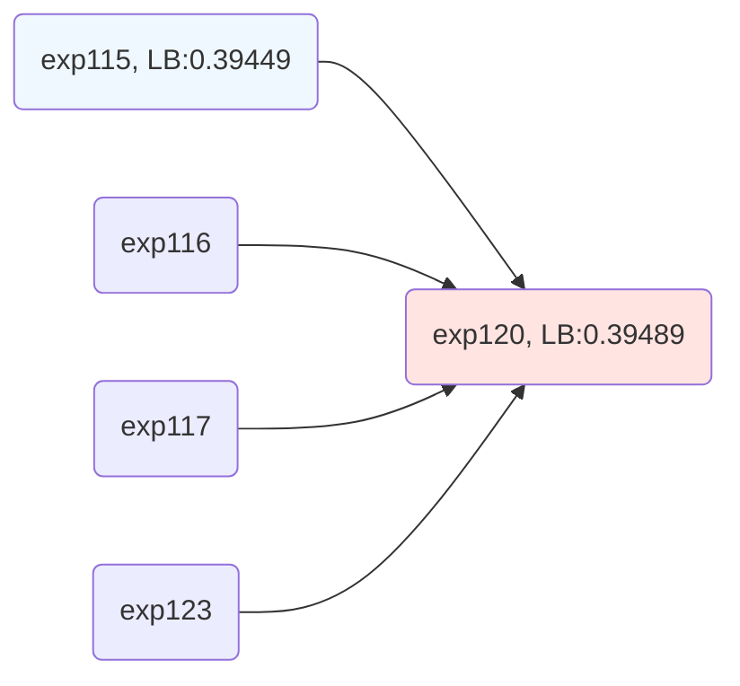
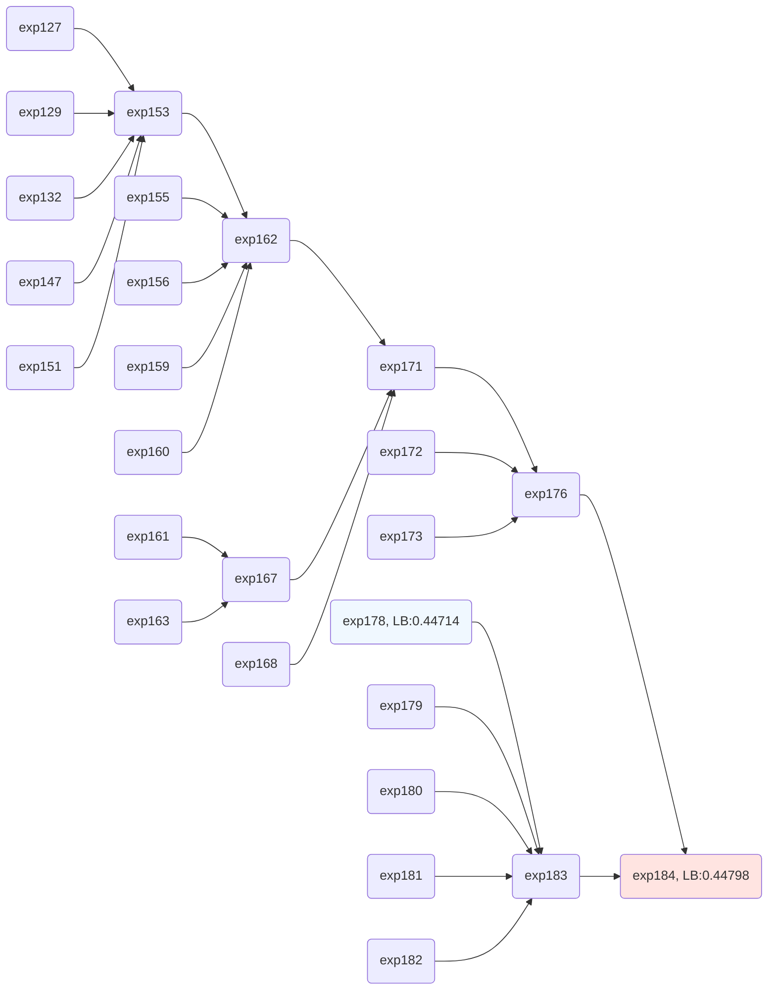

# amazon-kddcup2023-solution
This repositry is for codes and the solution of our team of [Amazon KDD Cup '23](https://www.aicrowd.com/challenges/amazon-kdd-cup-23-multilingual-recommendation-challenge) (only Task1 and Task2).

- Team name
    - [chimuichimu](https://www.aicrowd.com/challenges/amazon-kdd-cup-23-multilingual-recommendation-challenge/teams/chimuichimu)
- Team member
    - [chimuichimu](https://www.aicrowd.com/participants/chimuichimu)
    - [ddd335ttt](https://www.aicrowd.com/participants/ddd335ttt)
- Results
    - task1 -> 11th
    - task2 -> 6th

Table of Contents
- [amazon-kddcup2023-solution](#amazon-kddcup2023-solution)
  - [How to Run](#how-to-run)
    - [Setup](#setup)
    - [Task1](#task1)
      - [Best Single Model](#best-single-model)
      - [Blending](#blending)
    - [Task2](#task2)
      - [Best Single Model](#best-single-model-1)
      - [Blending](#blending-1)
  - [Solution Description](#solution-description)
    - [Overview](#overview)
    - [Candidate Generation](#candidate-generation)
    - [Ranking](#ranking)
      - [Model](#model)
      - [Features](#features)
    - [Ensemble](#ensemble)
    - [Environment](#environment)


## How to Run
### Setup
Download data from [the competition page](https://www.aicrowd.com/challenges/amazon-kdd-cup-23-multilingual-recommendation-challenge/problems/task-1-next-product-recommendation/dataset_files) and place data in `data\raw`.

Run following codes to preprocess raw data.
```
- notebooks\preprocess\task1\preprocess_task1_02.ipynb
- notebooks\preprocess\task2\preprocess_task2_05.ipynb
- notebooks\preprocess\task2\preprocess_task2_06.ipynb 
- notebooks\preprocess\task3\preprocess_task3_02.ipynb
- notebooks\preprocess\common\preprocess_common_01.ipynb
- notebooks\preprocess\common\preprocess_common_03.ipynb
- notebooks\preprocess\common\preprocess_common_04.ipynb
```

Note:
- We use the test data of Task3 for feature engineering or candidate generation.

### Task1

#### Best Single Model
To reproduce the best single model, run following codes from above.

feature engineering
```
- notebooks\feature_generation\task1\session_feature\session_feature_06.ipynb
- notebooks\feature_generation\task1\product_feature\product_feature_08.ipynb
```

candidates generation
```
- notebooks\candidates_generation\task1\similar_products\similar_products_10_DE.ipynb
- notebooks\candidates_generation\task1\similar_products\similar_products_10_JP.ipynb
- notebooks\candidates_generation\task1\similar_products\similar_products_10_UK.ipynb
- notebooks\candidates_generation\task1\similar_products\similar_products_13.ipynb
- notebooks\candidates_generation\task1\similar_products\similar_products_19_DE.ipynb
- notebooks\candidates_generation\task1\similar_products\similar_products_19_JP.ipynb
- notebooks\candidates_generation\task1\similar_products\similar_products_19_UK.ipynb
- notebooks\candidates_generation\task1\similar_products\similar_products_19.ipynb
- notebooks\candidates_generation\task1\matrix_factorization\imf_15_DE.ipynb
- notebooks\candidates_generation\task1\matrix_factorization\imf_15_JP.ipynb
- notebooks\candidates_generation\task1\matrix_factorization\imf_15_UK.ipynb
- notebooks\candidates_generation\task1\matrix_factorization\imf_15.ipynb
- notebooks\candidates_generation\task1\matrix_factorization\bpr_01_DE.ipynb
- notebooks\candidates_generation\task1\matrix_factorization\bpr_01_JP.ipynb
- notebooks\candidates_generation\task1\matrix_factorization\bpr_01_UK.ipynb
- notebooks\candidates_generation\task1\matrix_factorization\bpr_01.ipynb
- notebooks\candidates_generation\task1\co_visit_matrix\covisit_matrix_25.ipynb
- notebooks\candidates_generation\task1\co_visit_matrix\covisit_matrix_27.ipynb
- notebooks\candidates_generation\task1\co_visit_matrix\covisit_matrix_28.ipynb
- notebooks\candidates_generation\task1\co_visit_matrix\covisit_matrix_29.ipynb
- notebooks\candidates_generation\task1\co_visit_matrix\covisit_matrix_30.ipynb
- notebooks\candidates_generation\task1\proNE\proNE_task1_03.ipynb
- notebooks\candidates_generation\task1\item2vec\item2vec_05_for_train.ipynb
- notebooks\candidates_generation\task1\item2vec\item2vec_05_for_inference.ipynb
```

data processing for training and inference
```
notebooks\experiments\task1\exp115_process_data.ipynb
```

training
```
notebooks\experiments\task1\exp115_train.ipynb
```

inference
```
notebooks\experiments\task1\exp115_infer.ipynb
```

#### Blending
To reproduce ensambled predictions, which achieve our best LB score, run following codes from above in addition to the best single model codes.

training
```
- notebooks\experiments\task1\exp116_train.ipynb
- notebooks\experiments\task1\exp117_train.ipynb
- notebooks\experiments\task1\exp123_train.ipynb
```

inference
```
- notebooks\experiments\task1\exp116_infer.ipynb
- notebooks\experiments\task1\exp117_infer.ipynb
- notebooks\experiments\task1\exp123_infer.ipynb
```

blending
```
notebooks\ensamble\task1\exp120.ipynb
```

### Task2

#### Best Single Model
To reproduce the best single model, run following codes from above.

feature engineering
```
- notebooks\feature_generation\task2\session_feature\session_feature_09.ipynb
- notebooks\feature_generation\task2\product_feature\product_feature_12.ipynb
```

candidates generation
```
- notebooks\candidates_generation\task2\similar_products\similar_products_17.ipynb
- notebooks\candidates_generation\task2\similar_products\similar_products_27.ipynb
- notebooks\candidates_generation\task2\matrix_factorization\imf_31.ipynb
- notebooks\candidates_generation\task2\matrix_factorization\imf_32.ipynb
- notebooks\candidates_generation\task2\matrix_factorization\imf_33.ipynb
- notebooks\candidates_generation\task2\matrix_factorization\imf_34.ipynb
- notebooks\candidates_generation\task2\matrix_factorization\bpr_60.ipynb
- notebooks\candidates_generation\task2\co_visit_matrix\covisit_matrix_32.ipynb
- notebooks\candidates_generation\task2\co_visit_matrix\covisit_matrix_33.ipynb
- notebooks\candidates_generation\task2\co_visit_matrix\covisit_matrix_34.ipynb
- notebooks\candidates_generation\task2\co_visit_matrix\covisit_matrix_35.ipynb
- notebooks\candidates_generation\task2\co_visit_matrix\covisit_matrix_36.ipynb
- notebooks\candidates_generation\task2\proNE\proNE_task2_07.ipynb
- notebooks\candidates_generation\task2\item2vec\item2vec_16.ipynb
```

data processing for training and inference
```
notebooks\experiments\task2\exp178_process_data.ipynb
```

training
```
notebooks\experiments\task2\exp178_train.ipynb
```

inference
```
notebooks\experiments\task2\exp178_infer.ipynb
```

#### Blending

To reproduce ensambled predictions, which achieve our best LB score, run following codes from above in addition to the best single model codes.

feature engineering
```
- notebooks\feature_generation\task2\session_feature\session_feature_07.ipynb
- notebooks\feature_generation\task2\session_feature\session_feature_08.ipynb
- notebooks\feature_generation\task2\session_feature\session_feature_10.ipynb
- notebooks\feature_generation\task2\product_feature\product_feature_09.ipynb
- notebooks\feature_generation\task2\product_feature\product_feature_11.ipynb
- notebooks\feature_generation\task2\cf_feature\cf_feature_01.ipynb
- notebooks\feature_generation\task2\cf_feature\cf_feature_02.ipynb
```

candidates generation
```
- notebooks\candidates_generation\task2\similar_products\similar_products_26.ipynb
- notebooks\candidates_generation\task2\matrix_factorization\imf_35.ipynb
- notebooks\candidates_generation\task2\matrix_factorization\imf_36.ipynb
- notebooks\candidates_generation\task2\matrix_factorization\imf_37.ipynb
- notebooks\candidates_generation\task2\matrix_factorization\imf_38.ipynb
- notebooks\candidates_generation\task2\matrix_factorization\bpr_58.ipynb
- notebooks\candidates_generation\task2\matrix_factorization\bpr_59.ipynb
- notebooks\candidates_generation\task2\co_visit_matrix\covisit_matrix_37.ipynb
- notebooks\candidates_generation\task2\co_visit_matrix\covisit_matrix_38.ipynb
- notebooks\candidates_generation\task2\co_visit_matrix\covisit_matrix_39.ipynb
- notebooks\candidates_generation\task2\co_visit_matrix\covisit_matrix_40.ipynb
- notebooks\candidates_generation\task2\co_visit_matrix\covisit_matrix_41.ipynb
- notebooks\candidates_generation\task2\proNE\proNE_task2_08.ipynb
- notebooks\candidates_generation\task2\item2vec\item2vec_17.ipynb
- notebooks\candidates_generation\task2\item2vec\item2vec_19.ipynb
```

data processing for training and inference
```
- notebooks\experiments\task2\exp127_process_data.ipynb
- notebooks\experiments\task2\exp129_process_data.ipynb
- notebooks\experiments\task2\exp132_process_data.ipynb
- notebooks\experiments\task2\exp147_process_data.ipynb
- notebooks\experiments\task2\exp151_process_data.ipynb
- notebooks\experiments\task2\exp155_process_data.ipynb
- notebooks\experiments\task2\exp156_process_data.ipynb
- notebooks\experiments\task2\exp159_process_data.ipynb
- notebooks\experiments\task2\exp160_process_data.ipynb
- notebooks\experiments\task2\exp161_process_data.ipynb
- notebooks\experiments\task2\exp163_process_data.ipynb
- notebooks\experiments\task2\exp168_process_data.ipynb
- notebooks\experiments\task2\exp172_process_data.ipynb
- notebooks\experiments\task2\exp173_process_data.ipynb
```

training
```
- notebooks\experiments\task2\exp127_train_and_infer.ipynb
- notebooks\experiments\task2\exp129_train_and_infer.ipynb
- notebooks\experiments\task2\exp132_train.ipynb
- notebooks\experiments\task2\exp147_train.ipynb
- notebooks\experiments\task2\exp151_train.ipynb
- notebooks\experiments\task2\exp155_train.ipynb
- notebooks\experiments\task2\exp156_train.ipynb
- notebooks\experiments\task2\exp159_train.ipynb
- notebooks\experiments\task2\exp160_train.ipynb
- notebooks\experiments\task2\exp161_train.ipynb
- notebooks\experiments\task2\exp163_train.ipynb
- notebooks\experiments\task2\exp168_train.ipynb
- notebooks\experiments\task2\exp172_train.ipynb
- notebooks\experiments\task2\exp173_train.ipynb
- notebooks\experiments\task2\exp179_train.ipynb
- notebooks\experiments\task2\exp180_train.ipynb
- notebooks\experiments\task2\exp181_train.ipynb
- notebooks\experiments\task2\exp182_train.ipynb
```

inference
```
- notebooks\experiments\task2\exp132_infer.ipynb
- notebooks\experiments\task2\exp147_infer.ipynb
- notebooks\experiments\task2\exp151_infer.ipynb
- notebooks\experiments\task2\exp155_infer.ipynb
- notebooks\experiments\task2\exp156_infer.ipynb
- notebooks\experiments\task2\exp159_infer.ipynb
- notebooks\experiments\task2\exp160_infer.ipynb
- notebooks\experiments\task2\exp161_infer.ipynb
- notebooks\experiments\task2\exp163_infer.ipynb
- notebooks\experiments\task2\exp168_infer.ipynb
- notebooks\experiments\task2\exp172_infer.ipynb
- notebooks\experiments\task2\exp173_infer.ipynb
- notebooks\experiments\task2\exp179_infer.ipynb
- notebooks\experiments\task2\exp180_infer.ipynb
- notebooks\experiments\task2\exp181_infer.ipynb
- notebooks\experiments\task2\exp182_infer.ipynb
```

blending
```
- notebooks\ensamble\task2\exp153.ipynb
- notebooks\ensamble\task2\exp162.ipynb
- notebooks\ensamble\task2\exp167.ipynb
- notebooks\ensamble\task2\exp171.ipynb
- notebooks\ensamble\task2\exp176.ipynb
- notebooks\ensamble\task2\exp183.ipynb
- notebooks\ensamble\task2\exp184.ipynb
```

## Solution Description

### Overview
In this task, it was necessary to select products for recommendation from a large number of products for a large number of users. It was not realistic from a computational point of view to use a model such as machine learning models to predict the score of "Does the user prefer the product?" for all combinations of users and products.

So we selected the approach based on **[two-stage recommendation](https://dl.acm.org/doi/abs/10.1145/3366423.3380130)**. Our recommendation pipeline consists of two stages: **Candidate Generation** and **Ranking**. The first stage, Candidate Generation, uses methods such as collaborative filtering and content-based filtering to generate approximately several hundred candidates per session. In the second stage, Ranking, machine learning models calculate the best recommended products for the user based on the extracted candidates and the features created from the session and product information. This approach solved the problem of computational complexity while achieving highly accurate recommendations.

Blending the outputs from several rankers, the final result is as follows.
|       | LB Score (Best single model) | LB Score (After blending) | LB Rank |
| ----- | ---------------------------- | ------------------------- | ------- |
| Task1 | 0.39449                      | 0.39484                   | 11      |
| Task2 | 0.44714                      | 0.44798                   | 6       |

In this document, we mainly explain the following
- Methods of candidate generation
- Feature engineering and models for ranking candidates
- Ensamble methods

### Candidate Generation

We were provided with data on customer behavior history and product information. Using these data, we tried several candidate generation methods, including methods based on **collaborative filtering** and methods based **content-based filtering**. The table below lists the candidate generation methods used in the best single models for Task1 and Task2.

| #    | Task  | Candidate Name          | TOP K | Description                                                                                                                                                                                                                                                                                                                                                                                                                                                                                                                                                          |
| ---- | ----- | ----------------------- | ----- | -------------------------------------------------------------------------------------------------------------------------------------------------------------------------------------------------------------------------------------------------------------------------------------------------------------------------------------------------------------------------------------------------------------------------------------------------------------------------------------------------------------------------------------------------------------------- |
| 1-1  | Task1 | co_visit_matrix_1       | 200   | * Calculate **co-occurrence between items** (e.g., Item A and Item B are often actioned in the same session), and use top items with the high co-occurrence score with the item in sessions as a candidate.<br>* Give **weight to the score according to the distance between items in sessions**. For example, if B appears immediately after A, multiply by 3; if B appears four after A, multiply by 0.1, and so on.                                                                                                                                              |
| 1-2  | Task1 | co_visit_matrix_2       | 200   | Almost same as 1-1, but use **lift values** obtained by dividing co-occurrence scores by the number of occurrences of each item.                                                                                                                                                                                                                                                                                                                                                                                                                                     |
| 1-3  | Task1 | co_visit_matrix_3       | 100   | Co-occurrence scores are calculated based on **consecutive items** and top items with high co-occurrence score is selected as a candidate                                                                                                                                                                                                                                                                                                                                                                                                                            |
| 1-4  | Task1 | co_visit_matrix_4       | 100   | Co-occurrence scores are calculated based on **forward at most 3 consecutive** and top items with high co-occurrence score is selected as a candidate                                                                                                                                                                                                                                                                                                                                                                                                                |
| 1-5  | Task1 | co_visit_matrix_5       | 100   | Co-occurrence scores are calculated based on **forward at most 5 consecutive** and top items with high co-occurrence score is selected as a candidate                                                                                                                                                                                                                                                                                                                                                                                                                |
| 1-6  | Task1 | similar_product_1       | 150   | * Calculate **TF-IDF vectors** from the text data combining the following item information, and top items with high cosine similarity between items in sessions are selected as a candidate.<br>- title<br>    - color<br>    - size<br>    - model<br>    - material<br>    - author<br>    - brand<br>    - desc<br><br>* We used [TfidfVectorizer by scikit learn](https://scikit-learn.org/stable/modules/generated/sklearn.feature_extraction.text.TfidfVectorizer.html) for calculation of TF-IDF vectors.                                                     |
| 1-7  | Task1 | similar_product_2       | 25    | * Embedding vectors are calculated using **BERT** pre-trained models from the title of each item, and top items with high vector cosine similarity to items in sessions are selected as a candidate.<br><br>* We used different pre-trained BERT models for each locale.<br>    - UK：https://huggingface.co/bert-base-uncased<br>    - JP：https://huggingface.co/cl-tohoku/bert-base-japanese-whole-word-masking<br>    - DE：https://huggingface.co/dbmdz/bert-base-german-uncased                                                                                |
| 1-8  | Task1 | bpr                     | 50    | * Using **Bayesian Personalized Ranking (BPR)**, a type of matrix decomposition methods, top items with high score for each session are candidates.<br>* We used [BayesianPersonalizedRanking by implicit](https://github.com/benfred/implicit/blob/main/implicit/cpu/bpr.pyx) for calculation of BPR.                                                                                                                                                                                                                                                               |
| 1-9  | Task1 | imf                     | 100   | * Using **Implicit Matrix Factorizaton (IMF)**, a type of matrix decomposition methods, top items with high score for each session are candidates.<br>* We used [AlternatingLeastSquares by implicit](https://github.com/benfred/implicit/blob/main/implicit/cpu/als.py) for calculation of IMF.                                                                                                                                                                                                                                                                     |
| 1-10 | Task1 | proNE                   | 25    | * Items in sessions are considered as nodes, and the relationships between items that appear in succession are considererd as edges, we constructed **graph data** from session data. From graph data, we obtained embedding vectors of each nodes (=items) using [**proNE**](https://www.ijcai.org/proceedings/2019/0594.pdf). Based on the obtained embedding vectors, top items with high cos similarity to the items in the session are selected as candidates.<br>* We used the following implemetation.<br>https://github.com/THUDM/ProNE/blob/master/proNE.py |
| 2-1  | Task2 | co_visit_matrix_1       | 200   | same as 1-1                                                                                                                                                                                                                                                                                                                                                                                                                                                                                                                                                          |
| 2-2  | Task2 | co_visit_matrix_2       | 100   | same as 1-2                                                                                                                                                                                                                                                                                                                                                                                                                                                                                                                                                          |
| 2-3  | Task2 | co_visit_matrix_3       | 100   | same as 1-3                                                                                                                                                                                                                                                                                                                                                                                                                                                                                                                                                          |
| 2-4  | Task2 | co_visit_matrix_4       | 100   | same as 1-4                                                                                                                                                                                                                                                                                                                                                                                                                                                                                                                                                          |
| 2-5  | Task2 | co_visit_matrix_5       | 100   | same as 1-5                                                                                                                                                                                                                                                                                                                                                                                                                                                                                                                                                          |
| 2-6  | Task2 | simlar_product          | 300   | same as 1-6                                                                                                                                                                                                                                                                                                                                                                                                                                                                                                                                                          |
| 2-7  | Task2 | bpr                     | 100   | same as 1-8                                                                                                                                                                                                                                                                                                                                                                                                                                                                                                                                                          |
| 2-8  | Task2 | imf_1                   | 200   | same as 1-9                                                                                                                                                                                                                                                                                                                                                                                                                                                                                                                                                          |
| 2-9  | Task2 | imf_2                   | 100   | Almost same as 1-9, but use only **recent 3 items** of each sessions for inference                                                                                                                                                                                                                                                                                                                                                                                                                                                                                   |
| 2-10 | Task2 | imf_3                   | 100   | Almost same as 1-9, but use only **recent 5 items** of each sessions for inference                                                                                                                                                                                                                                                                                                                                                                                                                                                                                   |
| 2-11 | Task2 | imf_4                   | 100   | Almost same as 1-9, but use only **recent 2 items** of each sessions for inference                                                                                                                                                                                                                                                                                                                                                                                                                                                                                   |
| 2-12 | Task2 | proNE                   | 50    | Same as 1-10                                                                                                                                                                                                                                                                                                                                                                                                                                                                                                                                                         |
| 2-13 | Task2 | same_brand_popular_item | 50    | Top items with the same brand as the items in the session and with high popularity (= actioned many times in overall session data) are candidates.                                                                                                                                                                                                                                                                                                                                                                                                                   |

Note:
- From the analysis of train data, we noticed that items that already appeared in the session do not appear in the next item. Therefore, in or after candidate generation, **items that had already appeared in the session are excluded**.
- From the analysis of product information data, we found that some products have the same id but different locale. Therefore, for Task2, which has less training data than Task1, **we calculated co-visit-matrix using Task1 data as well as Task2 to leverage session data from other major locales**. 

### Ranking

#### Model
We used LightGBM ranker to rank candidates. The following is the hyperparameters setting example of LightGBM model used in Task2.

```python
PARAMS = {
    "objective": "lambdarank",
    "metric": "ndcg",
    "boosting": "gbdt",
    "seed": SEED,
    "num_leaves": 50,
    "max_depth": 10,
    "learning_rate": 0.05,
    "feature_fraction": 0.9,
    "bagging_fraction": 0.9,
    "bagging_freq": 5,
    "min_data_in_leaf": 30,
    "eval_at": [100],
    "lambdarank_truncation_level" : 105,
    "deterministic":True,
}
```

#### Features
Around 100 features were created. The features we created are classified as "features from candidate", "features from session", "features from product", "features from session * product". Following is the list of the features we used in the best single models for Task1 and Task2.
- Features from candidate
    - co visit score and rank of the candidate to the last_{`n`} item of the session (`n`=[1, 2, 3])
    - TF-IDF vector similarity score and rank of the candidate to the last_{`n`} item of the session (`n`=[1, 2, 3])
    - BERT embedding vector similarity score and rank of the candidate to the last_{`n`} item of the session (`n`=[1, 2, 3], only Task1)
    - Graph embedding vector (by proNE) similarity score and rank of the candidate to the last_{`n`} item of the session (`n`=[1, 2, 3])
    - IMF score and rank of the candidate to the session
    - BPR score and rank of the candidate to the session
    - same brand popularity rank of the candidate to the last_{`n`} item of the session (`n`=[1, 2, 3], only Task2)
- Features from session
    - locale
    - session length
    - n_unique items of the session
    - ratio of n_unique items to the session length
    - n_unique brands of the session
    - ratio of n_unique brands to the session length 
    - mean price of items of the session
    - max price of items of the session
    - min price of items of the session
    - standard deviation of prices of items of the session
    - total price of items of the session
- Features from product
    - price
    - total action count (global)
    - total action count (locale)
    - total action count * price (global)
    - total action count * price (locale)
    - total action count of product's brand (global)
    - total action count of product's brand (locale)
    - product's brand mean price
    - product's brand max price
    - product's brand min price
    - product's brand standard deviation of prices
    - price diff to mean brand price
    - number of locales that carry the product
    - is {`column`} null or not (`column`=[color, size, model, material, author])
    - action count ratio to total action count
    - action count * price ratio to total action count * price
    - action count ratio to total action count of product's brand
    - action count * price ratio to total action count * price of product's brand
- Features from session * product
    - product's price diff to mean price of items of the session
    - product's price diff to min price of items of the session
    - product's price diff to max price of items of the session
    - product's price diff to last price of items of the session
    - product's brand mean price diff to mean price of items of the session
    - product's brand mean price diff to min price of items of the session
    - product's brand mean price diff to max price of items of the session
    - product's brand mean price diff to last price of items of the session
    - is product's {`column`} same as last_{`n`} item of the session (`column`=[brand, color, size, model, material, author], `n`=[1, 2, 3])
    - items word2vec vector similarity to the last_{`n`} item of the session (`n`=[1, 2, 3])
    - items graph embedding vector (by proNE) similarity to the last_{`n`} item of the session (`n`=[1, 2, 3])
    - session to product IMF score
    - session to product BPR score

Note:
- Training data is **unbalanced with an overwhelming proportion of negative samples**, since there is only one next item that serves as a positive label while the number of the candidates generated is several hundred per session. So we downsampled negative samples: **use only 10% and 20% of the negative samples** in Task1 and Task2, respectively.

### Ensemble
We blend predictions of multiple single models (different amount of training data, different # of candidates, different candidates strategy, different LightGBM parameters,,,) based on rank and get better MRR on the leader board compared to single model. Our blending method is based on [this public notebook of Kaggle](https://www.kaggle.com/code/chaudhariharsh/lb-0-0238-h-m-ensembling-how-to-get-bronze).

Following chart show the blending pipeline for Task1 and Task2. Light blue boxes sshow the best single models and light red boxes show the final submission by blending.

**Task1**

**Task2**


### Environment
We mainly used **Google Colab Pro+** for data processing, training and inference. In the second half of the competition, the amount of training data was larger and higher memory was neeeded, so **GCP's Custom VMs** were used only for model training.
